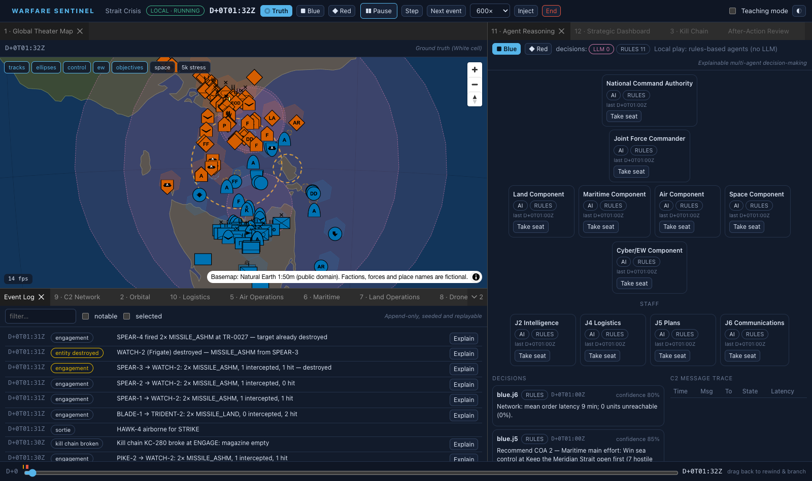
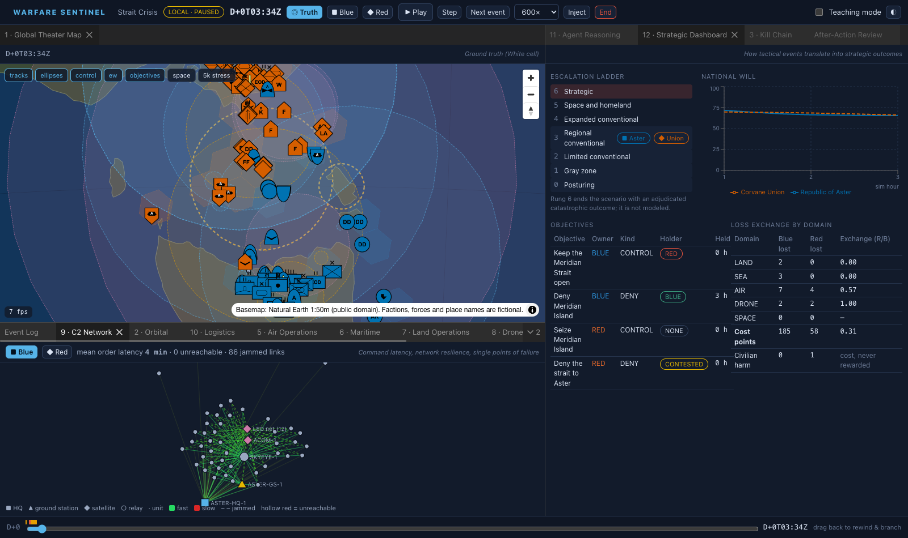
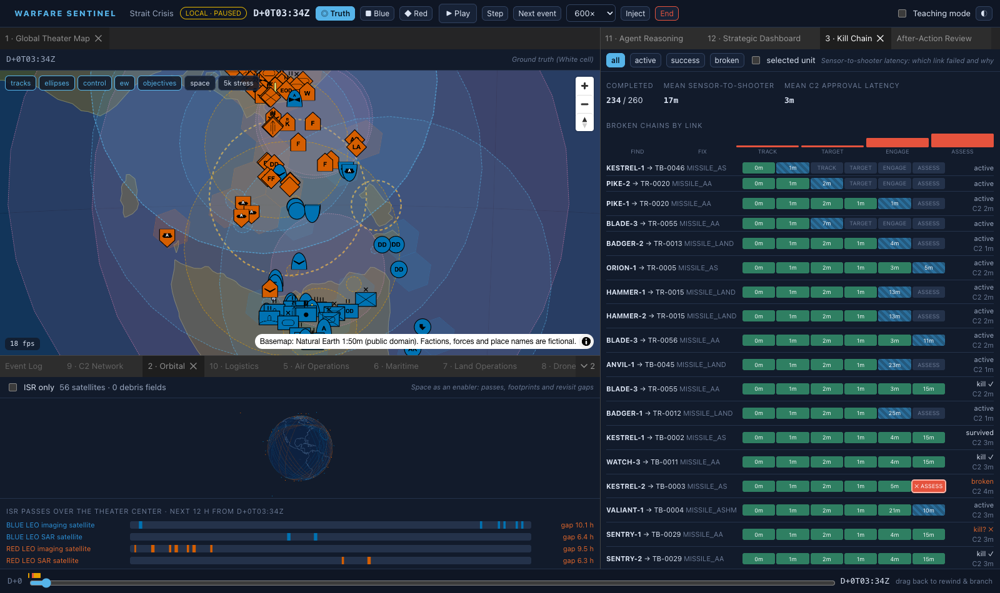

# WARFARE SENTINEL

A multi-domain, multi-agent wargame for teaching and studying how joint operations behave as systems. AI agents (and any human who takes their seat) command notional forces across land, sea, air, drones and space on a real-world map. The game shows how sensing, command latency, logistics and attrition interact.

**Live:** https://warfare-sentinel.troche.workers.dev (Cloudflare Workers free tier)



The full design is in [docs/specs.md](docs/specs.md) (the system specification) and [docs/implementation.md](docs/implementation.md) (the Cloudflare free-tier plan). This README covers what was built, how to run it, and where the build differs from the plan.

> Educational and research use only. Every performance value is a notional band, not real data. Factions, forces and place names are fictional, and the starter scenarios put these fictional actors on real geography. Nothing connects to real C2, sensor or weapon systems or to live feeds. LLM agents reason only at game-abstraction level. Civilian harm counts as a cost and is never rewarded.

## What you can do

- **Play locally.** No account or server is needed. The engine and rule-based agents run in your browser. You can rewind and branch from any moment ("what if Blue had waited 6 hours?"), and replay is deterministic.
- **Host online (Profile B, default).** The engine runs in the host's browser. Cloudflare hosts the session hub, the fog-of-war routing, the LLM commanders on Workers AI, the event log and the AAR. Other players join as Blue or Red with a join code and see only their own faction's picture.
- **Edge-authoritative (Profile A).** The engine runs inside a Durable Object in alarm-sized slices, with 10-minute ticks. It suits scenarios of up to about 300 entities.
- **Take any seat.** Seats can be taken at runtime, for example the Blue Air Component. You then issue orders with the same form and schema the agents use, and hand the seat back when done.
- **Batch runs.** Monte Carlo mode runs N seeds in a pool of Web Workers and shows the outcome distributions.

### The twelve consoles

| # | Console | Concept |
|---|---------|---------|
| 1 | Global Theater Map (MapLibre globe) | Common operational picture vs ground truth, track uncertainty, H3 control shading, EW fields |
| 2 | Orbital Console (three.js) | Client-side orbit propagation, ISR footprints, pass timeline and revisit gaps, debris shells |
| 3 | Kill Chain Console | F2T2EA swimlanes, time per stage, the link that broke and why |
| 4 | Sensor & Signature Console | Live P_d calculator, detection range vs signature, radar horizon, sonar layer |
| 5 | Air Operations Board | ATO Gantt, CAP stations, tankers, sortie-rate gauges |
| 6 | Maritime Console | Task groups, A2/AD bubbles, chokepoints, submarine probability areas |
| 7 | Land Operations Console | Force-ratio heat map, front-line trace, terrain, supply badges |
| 8 | Drone & Swarm Console | Flocking animation (datalink vs onboard autonomy under jamming), cost exchange |
| 9 | C2 Network Graph | Latency heat, jammed links dashed, unreachable units, order path from the HQ |
| 10 | Logistics Console | Sankey of supply flows, interdicted routes, days of supply |
| 11 | Agent Reasoning Console | Hierarchy, rationale per decision, LLM/RULES/CACHE/HUMAN badges, budget, message trace, audit log |
| 12 | Strategic Dashboard | Escalation ladder, national-will curves, objectives, loss exchange |

The console also has an event log with an **Explain** button on every outcome that has factors, a **teaching mode** that pauses at notable events and explains the concept, linked selection across all panels, and an **After-Action Review** whose turning points each link to events in the log. The palette is colorblind-safe (Okabe–Ito), unit symbols use frame shape as well as colour to show affiliation, and the main controls have keyboard shortcuts.




### Starter scenarios (real geography, fictional actors)

| Scenario | Region | Scale | Teaching focus |
|----------|--------|-------|----------------|
| Strait Crisis | Bass Strait; Flinders Island is the disputed "Meridian Island" | Regional, 10 days | A2/AD, sea control, ISR revisit gaps |
| Northern Plains | The Pampas | Regional, 14 days | Combined arms, logistics, attritable drones |
| Archipelago | Hawaiian island chain | Regional, 21 days | Distributed operations, tanker and supply limits |
| Dark Skies | Australia vs southern Africa over the Kerguelen plateau | Global, 7 days | Degraded PNT, comms and ISR |
| Sandbox | Cook Strait | Any | Free play for designers |

Scenarios are generated by [tools/gen-scenarios.mjs](tools/gen-scenarios.mjs). A test checks every unit and objective against the Natural Earth 1:50m coastline.

## Architecture

```text
browser (host)                          Cloudflare (free tier)
┌──────────────────────────┐   WS    ┌──────────────────────────────────────────┐
│ React console            │◀──────▶│ Worker: /api/*, /ws/*, static assets       │
│ Web Worker: World Engine │ deltas  │ SessionDO   hub, seats, event log (SQLite),│
│  + local rules agents    │  ≤1/s   │             snapshots, Profile A slices    │
└──────────────────────────┘         │ FactionAgent (Agents SDK) ×3 per session   │
browser (Blue / Red players) ◀──────│   COP only → Workers AI → orders           │
                                     │ UsageDO     neuron budget governor         │
                                     │ D1 sessions/AAR/archives · KV flags        │
                                     └──────────────────────────────────────────┘
```

```text
packages/protocol      Zod order schema, frames, msgpack codecs, view types (the fog-of-war boundary)
packages/catalog       42 notional asset classes (bands only), validator, role authority
packages/engine        deterministic World Engine: movement (A* on H3), sensing, J2 fusion, C2 network,
                       kill chains, Lanchester combat, logistics, orbits (J2), escalation, AAR
packages/agents-rules  utility-AI policy per role (NCA … J6) and cadence scheduler
scenarios/             starter scenarios + validation tests
apps/edge              Worker, SessionDO, FactionAgent, UsageDO, D1 migrations, wrangler.jsonc
apps/console           React + Vite SPA, engine Web Worker, Monte Carlo workers, Playwright e2e
tools/                 scenario generator, Profile A slice benchmark
```

The engine has no platform dependencies. It uses its own polynomial `sin/cos/atan2/exp/log` and a seeded xoshiro128** generator, and it never reads `Date` or `Math.random`. As a result, the same seed and order log give byte-identical event logs, and a run sliced for Profile A matches the same run done in whole ticks.

## Running it

Requirements: Node 22+ and pnpm 10+ (`npm i -g pnpm`).

```bash
pnpm install
pnpm dev                                   # console on http://localhost:5173 (local play works without the API)
```

To run the full stack locally (API, hub and agents), build the console and start the Worker:

```bash
pnpm build
cd apps/edge
echo "JOIN_SECRET=$(openssl rand -hex 32)" > .dev.vars
npx wrangler d1 migrations apply sentinel --local
npx wrangler dev                           # http://localhost:8787
```

Workers AI bindings always call the remote service, even in `wrangler dev`. The `--local` flag disables them, and agents then fall back to their rule-based policies.

## Testing

```bash
pnpm -r typecheck && pnpm -r test          # 36 unit tests across 5 packages
pnpm --filter @sentinel/console e2e        # Playwright, headless Chromium (builds and serves the console)
E2E_BASE_URL=https://warfare-sentinel.troche.workers.dev pnpm --filter @sentinel/console e2e   # against a deployment
pnpm bench:slices                          # Profile A slice timings per scenario
```

Coverage:

- **Engine:** byte-identical logs for the same seed and orders; different seeds diverge; sliced runs equal whole-tick runs; snapshot and restore continue identically; deterministic maths matches `Math`; fog-of-war views contain no enemy entities or truth links; an AAR whose turning points link to real events.
- **Agents:** every role's output passes the order schema; J5 ranks its courses of action; seats held by humans are skipped; recorded model outputs (clean, prose-wrapped, truncated, invalid) either parse or fall back cleanly; the lenient parser repairs common model slips.
- **Edge:** a static check that `FactionAgent` never imports ground-truth types; join tokens round-trip and reject tampering and expiry.
- **Scenarios:** catalogue and guardrail validation, and coastline placement checks.
- **End-to-end:** the lobby; a running session with the globe and every console; Blue-only symbols in the Blue view; rewind; Monte Carlo.

## Deploying (Cloudflare free tier)

The deployed instance was set up as follows:

```bash
npx wrangler d1 create sentinel                    # id pasted into apps/edge/wrangler.jsonc
npx wrangler kv namespace create SENTINEL_CONFIG   # id pasted into apps/edge/wrangler.jsonc
cd apps/edge
npx wrangler d1 migrations apply sentinel --remote
pnpm --filter @sentinel/console build && npx wrangler deploy
openssl rand -hex 32 | npx wrangler secret put JOIN_SECRET
```

After that, `pnpm deploy` rebuilds and redeploys. The included GitHub Actions workflow (`.github/workflows/deploy.yml`) runs the tests on every push. It also deploys `main`, but only once a `CLOUDFLARE_API_TOKEN` repository secret is added.

Optional extras:

- **R2 archive:** R2 is not enabled on this account, so event-log archives and snapshots are stored as gzip chunks in D1. To use R2 instead, enable it in the dashboard, run `wrangler r2 bucket create sentinel-archive`, and uncomment the `ARCHIVE` binding.
- **Turnstile:** active in production on session creation (managed widget `0x4AAAAAAFMyDmExnFzDStfE` for `warfare-sentinel.troche.workers.dev`, `localhost` and `127.0.0.1`). The lobby holds the online buttons until the check passes, and `POST /api/sessions` verifies the token with siteverify using the `TURNSTILE_SECRET` Worker secret. To disable it, clear `TURNSTILE_SITEKEY` and delete the secret. For local testing, use Cloudflare's always-pass test keys (sitekey `1x00000000000000000000AA`, secret `1x0000000000000000000000000000000AA`).
- **Model choice:** model ids are variables in `wrangler.jsonc` (`MODEL_OPERATIONAL`, `MODEL_STRATEGIC`, `MODEL_SUMMARY`).

### Free-tier budget

Workers AI neurons are the binding constraint (10,000 per day). `UsageDO` grants each session 6,000 neurons, keeps a reserve for the AAR call, and makes agents fall back to rules when either the grant or the daily allowance runs out. A "rules only" switch per session uses no neurons at all. Measured in production:

| Model | Neurons per call |
|-------|------------------|
| Qwen3-30B (thinking disabled), component commanders | about 7–22 |
| gpt-oss-120b (low reasoning effort), NCA | about 60 |

Daily usage is shown at `/usage` and `/api/admin/usage`. The host sends at most one delta per second. Hubs use the WebSocket Hibernation API, and events are stored as one SQLite row per tick batch.

## Acceptance criteria (spec §10)

| Criterion | Status |
|-----------|--------|
| Strait Crisis runs to completion at 600× with all agents AI-controlled, with no ground-truth leaks in faction logs | Engine and agents verified headless over multi-day runs, and fog-of-war tests pass. A full 10-day run with LLM agents was not run end to end, to stay within the daily neuron allowance. |
| Same seed and order log reproduce a byte-identical event log | ✅ unit test (`hashEvents`) |
| Jamming a SATCOM link raises order latency in the C2 Network Graph and Kill Chain Console | Modelled: jammed links get ×(1+3J) latency and lower reliability, and both consoles show the latency. No automated test covers this end to end. |
| Destroying a LEO imaging satellite widens revisit gaps and creates a debris field | Modelled: an ASAT kill creates a debris field, and the pass timeline recomputes gaps from the surviving satellites. Not covered by an automated test; at rung 5 the Space Component can order it. |
| A human takes over the Blue Air Component, issues a FRAGO and hands the seat back | ✅ verified in production with Playwright (two browsers, Profile B) |
| With the LLM budget at zero, every agent falls back to rules and the scenario completes | ✅ rules-only mode, budget fallback, and AI errors all fall back (seen in local dev) |
| AAR narrative links every turning point to at least one event | ✅ enforced for both the rules and the LLM narrative (invalid citations are dropped) |
| Globe renders 5,000 symbols at 60 fps on the reference laptop | A "5k stress" toggle and an FPS meter are built in. Not measured on reference hardware: headless CI uses software WebGL. |

## Differences from the implementation plan

- **Map stack:** MapLibre's native symbol layers on a globe projection replace deck.gl. The basemap is Natural Earth 1:50m GeoJSON bundled with the app, not tippecanoe vector tiles. Unit symbols are rendered by milsymbol when first needed, then cached, rather than prebuilt into a sprite atlas.
- **Scale:** the starter scenarios have 30–190 entities, which keeps local play and Profile A comfortable. The engine and validator accept up to 5,000 entities.
- **Archive storage:** D1 instead of R2 (see above).
- **Profile A:** this profile uses alarm slices of 40 work units. Measured p99 slice time is 0.3–2.6 ms in Node. The worst first slice (route planning and warm-up) can exceed the free 10 ms CPU limit, so Profile A is best used for small scenarios.
- **Host departure:** when the Profile B host leaves, the session pauses. When the host reconnects, it resumes from the latest hourly snapshot plus the orders forwarded since.
- **Branching:** online branching creates a new session from the nearest snapshot plus the forwarded orders. Local rewind replays the engine's own order log exactly.

## License

Basemap data: Natural Earth (public domain). Unit symbols: milsymbol (MIT).
